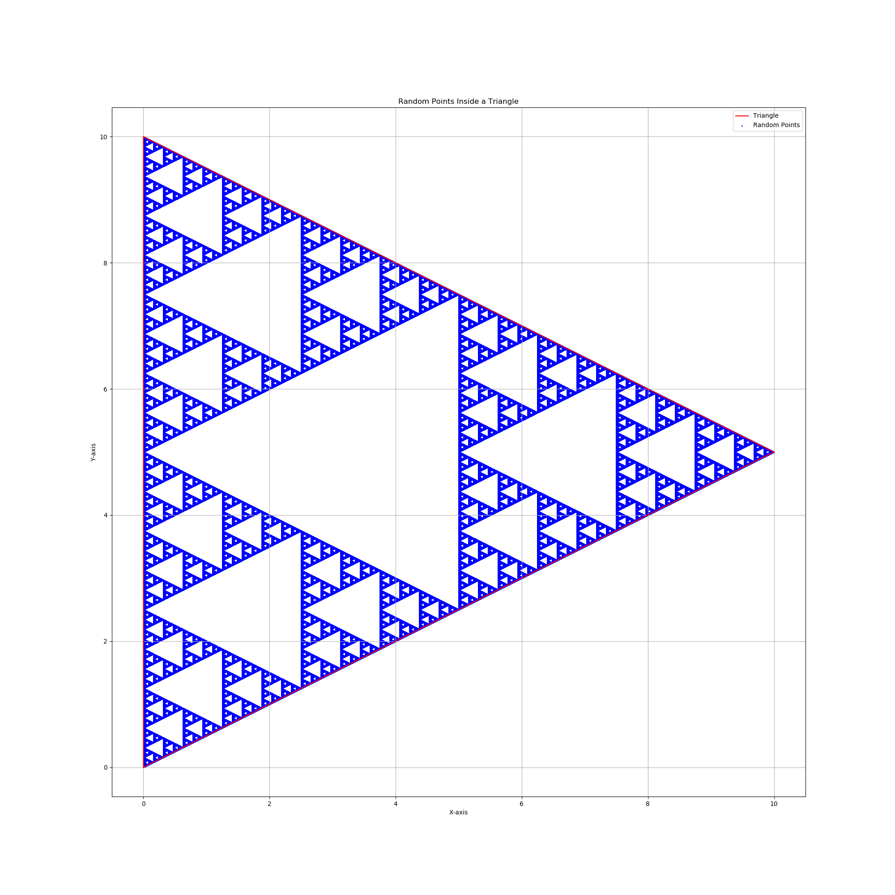

# Sierpiński Triangle

This repository contains a simple implementation for drawing the Sierpiński Triangle, a well-known fractal.

## Description

The Sierpiński Triangle is a fractal that exhibits self-similarity, meaning it looks the same at any level of magnification. This project provides a basic implementation to generate and display the triangle.

## Features

- Generates the Sierpiński Triangle using a recursive or iterative approach.
- Simple and lightweight implementation.
- Easy to modify for different levels of depth.

## Usage

1. Clone the repository:
   ```sh
   git clone <repository-url>
   ```
2. Navigate to the project directory:
   ```sh
   cd sierpinski-triangle
   ```
3. Run the script:
   ```sh
   <command-to-run-your-code>
   ```

## Requirements

- matplotlib


## Example Output



## License

This project is licensed under the MIT License - see the [LICENSE](LICENSE) file for details.

